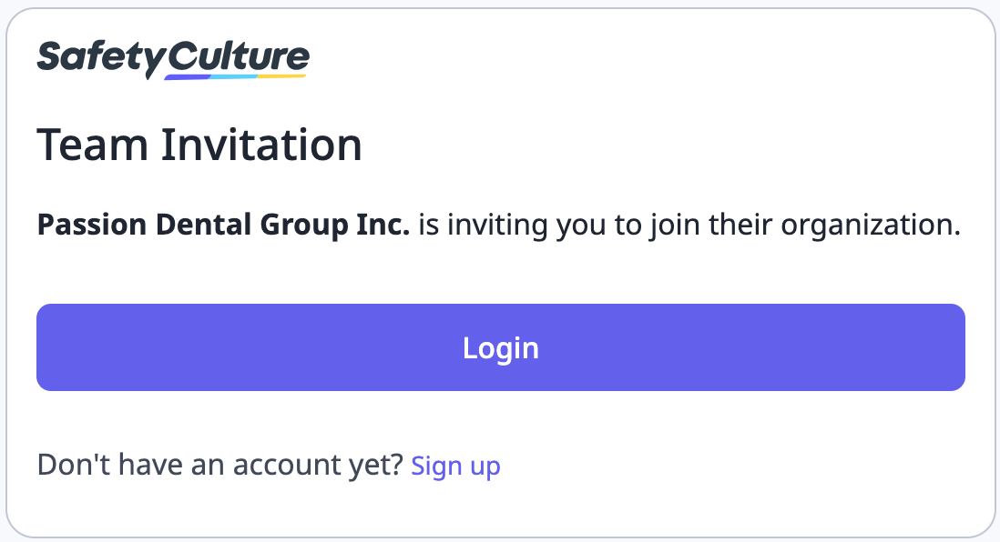

# Passion Dental Group IT Surveys

## Signing Up

You can sign up for Passion's iAuditor account using this link: <a href="https://app.safetyculture.com/invite/organisation/49841784da634c01aafaf2fee767c9b4" target="_blank">https://app.safetyculture.com/invite/organisation/49841784da634c01aafaf2fee767c9b4</a>

Once you click that link, you need to click on `Sign up` where it says `Do not have an account?`

After that, fill out your details and hit `Create your free account`!

## Start a survey

We recommend using an iPhone or iPad. This guide is completed using an iPhone. 

1. Find the `Safety Culture` app in the app store

2. Login to the Safety Culture (iAuditor) app using the account you made earlier.

3. Click on the `Inspections` button on the bottom of the app and then the `+` icon

4. Then hit, `Start an inspection` and `SV1 Inspection Form` from the template options

## Challenges?

If you're having challenges, please reach out Passion Dental Group's internal IT team.