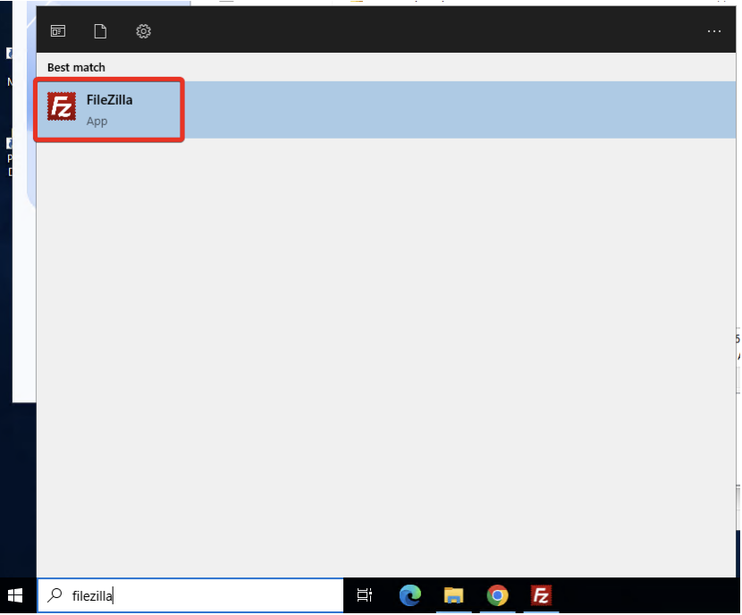
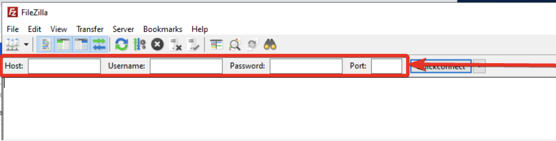
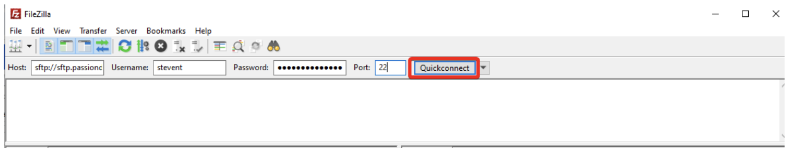
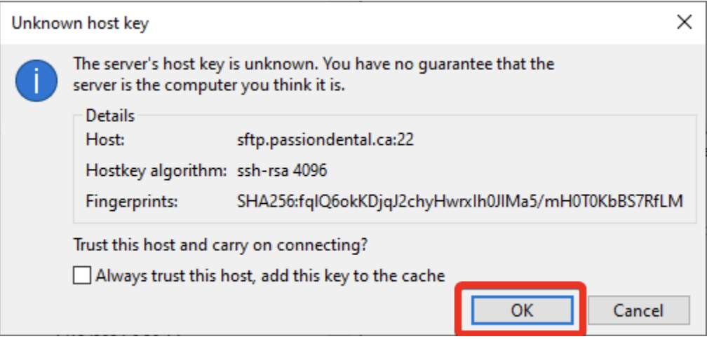
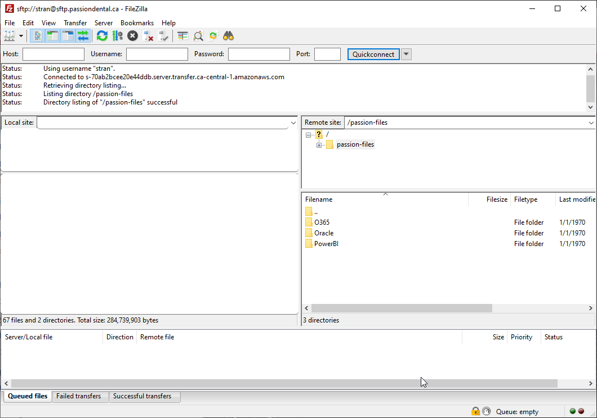
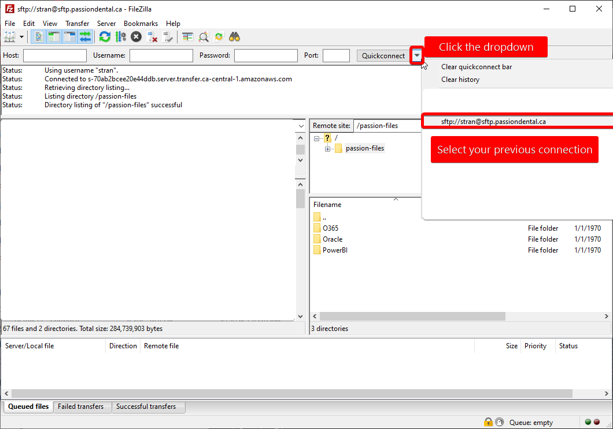

# Passion SFTP

## FileZilla

We use FileZilla as our FTP program. This program will allow you to connect to the Passion SFTP server.

### Downloads

You can download FileZilla for Mac or Windows using the links below:

* [Windows](https://public.passiondental.ca/filezilla/FileZilla_3.68.1_win64-setup.exe)
* [Macintosh](https://public.passiondental.ca/filezilla/FileZilla_3.68.1_macos-arm64.app.tar.bz2)

### How to connect

After you successfully install FileZilla, follow the below steps to connect to the Passion SFTP server.

#### Opening FileZilla

Open FileZilla by clicking on your start menu and searching for FileZilla

#### Connecting

1. Enter the following information in the top bar

Host: `sftp://sftp.passiondental.ca`
Username: your passion email without @passiondental.ca (e.g. If your passion email is
stevent@passiondental.ca you would enter `stevent`)
Password: `your passion email password`
Port: `22`

2. After you fill out the information, click Quickconnect.

3. Click OK on the unknown host key dialog.

#### You should be connected and can access resources in SFTP

### Reconnecting

You can reconnect by clicking on the dropdown in the top bar next to Quickconnect.

