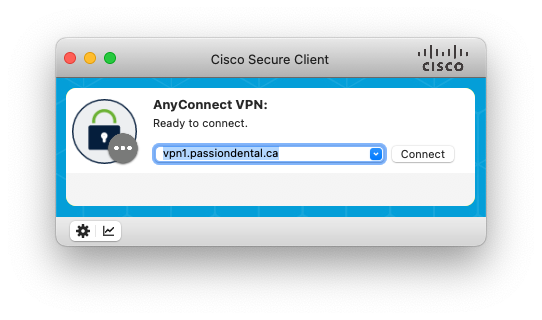
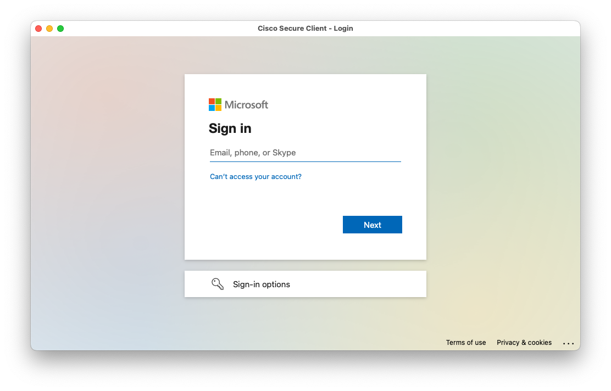
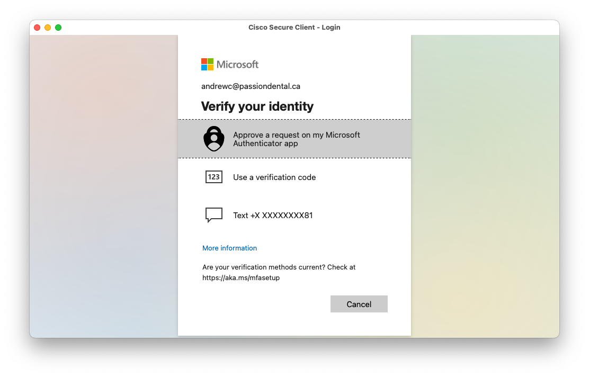
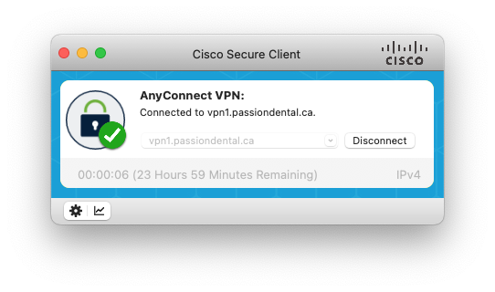

# Passion VPN

## Cisco AnyConnect

We use Cisco AnyConnect as our client VPN program. This program will build a VPN connection between your device and the Passion Dental Group network.

### Downloads

You can download Cisco AnyConnect for Mac or Windows using the links below:

* [Windows](https://public.passiondental.ca/cisco/cisco-secure-client-win-5.0.01242-predeploy-k9.zip)
* [Macintosh](https://public.passiondental.ca/cisco/cisco-secure-client-macos-5.0.01242-predeploy-k9.dmg)

### How to connect

After you successfully install Cisco AnyConnect, follow the below steps to connect to the Passion Dental Group network.

#### Type `vpn1.passiondental.ca` for the server name

#### Use your Passion account to authenticate

#### You should be connected and can access internal resources

