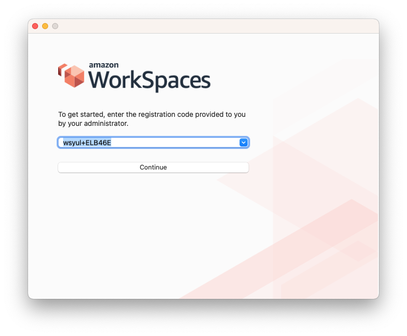

# Passion Dental Group Workspaces

This guide will demonstrate how to connect to Passion's Workspaces

## Connecting

### 1. Workspaces client

You will need to download the Workspaces client available [here](https://clients.amazonworkspaces.com/)

### 2. Install and connect

Once you have downloaded the client, installed it, and opened it, you can put in Passion's registration code, which is `wsyul+ELB46E`

### 3. Login and connect

Login using your Passion account. Please note: the username will *not* include the top level domain. For example, if my username is `john@passiondental.ca` then my username would be `john`.

