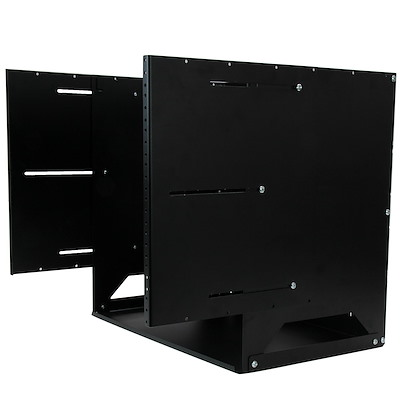
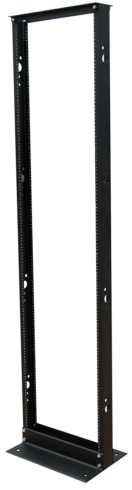
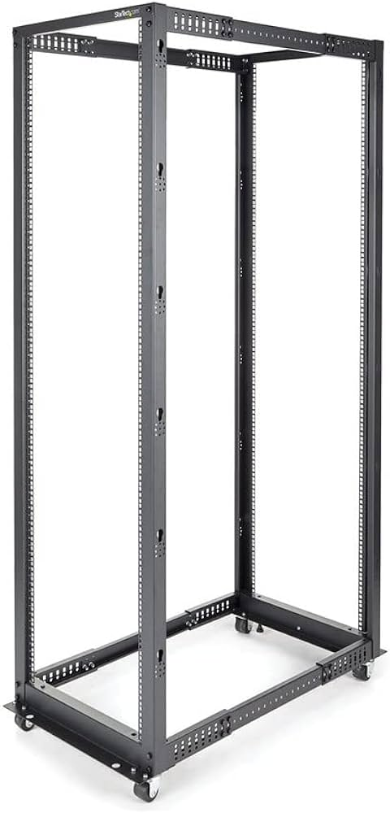
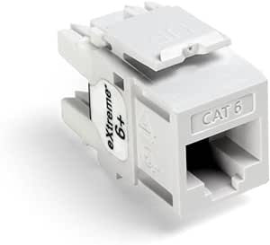

# Passion Dental Group Clinic IT Standards

## Network Racks

### Wall-mounted Option

Our most common network rack standard, the wall mount has 2U of shelf space and 8U of mounting space. The SKU is `WALLSHELF8U`.

### Ground Options

#### Two-post option

We have a standard two-post ground-secured option for larger clinics. The SKU is `SR2POST25`.

#### Four-post option

For larger clinics with the requirement for a more powerful server, we recommend a four-post enclosure for the server. The patch panels are to be installed on the top of the cabinet on either the back or front of the cabinet.

## Network Cabling

### Wiring

All cabling should be CAT 5e or better. Any new installations should use CAT 6 or better.

### Terminations

All terminations should use RJ45 keystone jacks (i.e. not RJ45 crystals). On the network switch end, we require a patch panel. Existing patch panels or keystone jacks must be CAT 5e or better and new installations should be CAT 6 or better.

